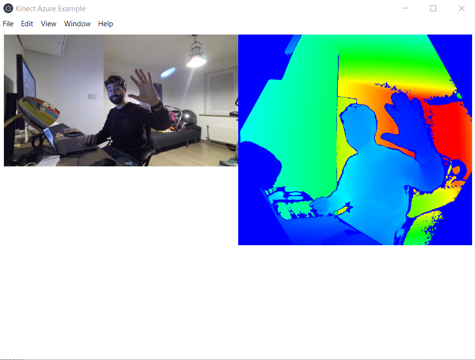

# Azure Kinect Library for Node / Electron

This library enables you to use the Azure Kinect in your nodejs or electron apps.



Features:

- get rgb camera feed
- get depth feed
- get skeleton joints (3d)

Coming later:

- map skeleton joints to 2d space
- user masking
- point cloud

## Installation

Make sure you have the Azure Kinect drivers installed.

Just npm install like you would do with any regular module. There are no precompiled binaries yet, so you need to have [node-gyp installed on your system](https://github.com/nodejs/node-gyp).

### Potential issues

You might run into the error below when trying to install this module:

```
Error: spawn C:\Program Files (x86)\Microsoft Visual Studio\2019\BuildTools\MSBuild\15.0\Bin\MSBuild.exe ENOENT
```

To fix this, make sure to install the latest version of node-gyp globally:

```
npm install -g node-gyp
```

### Body tracking

If you want to use body tracking, you will need to have a couple of dll files in the root of your application. Otherwise, you'll run into errors like the one below:

> Cannot locate onnxruntime.dll

The install script of this module tries copy these files automatically. You should have the following files in your application root after running npm install:

- onnxruntime.dll
- dnn_model_2_0.onnx
- cublas64_100.dll
- cudart64_100.dll
- vcomp140.dll
- cudnn64_7.dll

If you can't find these files, copy them from inside node_modules/kinect-azure to your project root.

## Examples

There are a couple of examples in the examples/ folder of this repo. You can run an example by executing npm install in that folder and npm start:

```
$ cd examples/electron/camera-feeds
$ npm install
$ npm start
```

